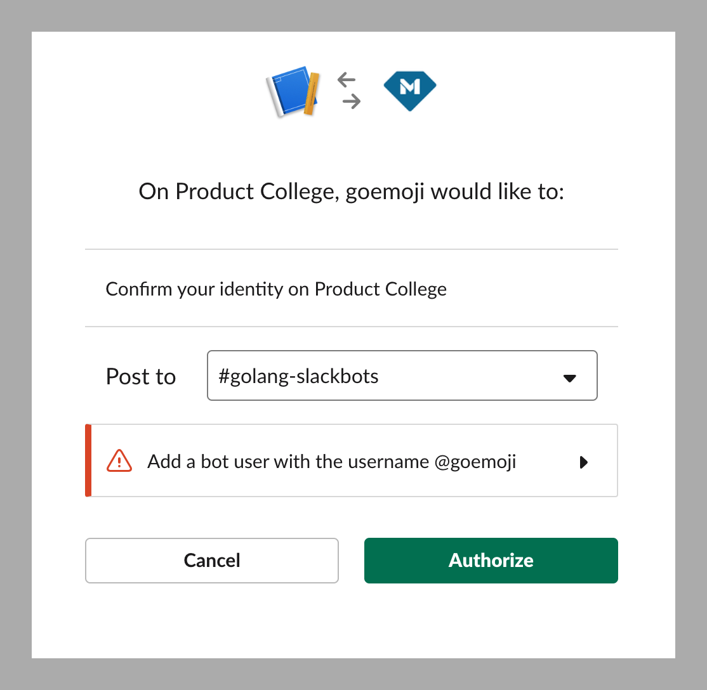
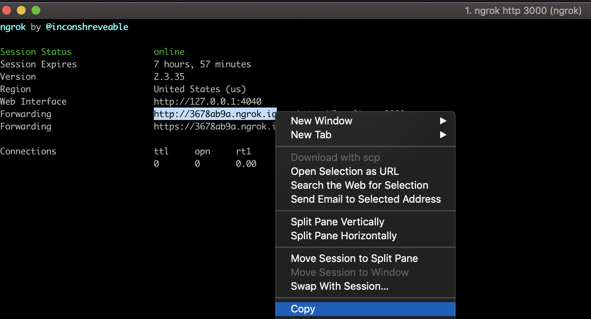
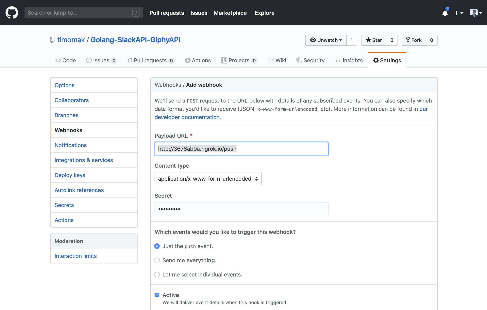

  
  

# CommitPing
 

Based on this class' project: [BEW 2.5 Go Routines Class 7](https://github.com/Make-School-Courses/BEW-2.5-Strongly-Typed-Ecosystems/blob/master/Lessons/Lesson07.md).

> CommitPing allows you to set up your own personal monitor to ping you on slack whenever any commits are made on a repository that you set up.

# How it works
1. You set up a [Webhook](https://www.google.com/url?sa=t&rct=j&q=&esrc=s&source=web&cd=30&cad=rja&uact=8&ved=2ahUKEwiArPLKwa7mAhVHRqwKHRVuDLwQmhMwHXoECA0QAg&url=https%3A%2F%2Fen.wikipedia.org%2Fwiki%2FWebhook&usg=AOvVaw2MS8FR1GZ18Pjr-5QHZKf0) on [Github](https://www.google.com/url?sa=t&rct=j&q=&esrc=s&source=web&cd=28&cad=rja&uact=8&ved=2ahUKEwidt_vlwa7mAhUFM6wKHYLdBmUQFjAbegQIDRAR&url=https%3A%2F%2Fhelp.github.com%2Fen%2Fgithub%2Fextending-github%2Fabout-webhooks&usg=AOvVaw1HbZjUHemVLYJvU82LzqTW) to ping a POST route on this project. 
1. The Webhook will send a payload of data about the commit. 
1. Using a SlackAPI, send a custom message to a channel of your choice each time a commit is made to the Github Repo. 

## Instructions
### Part 1: Create New Slack App

1. **Have these docs open and ready as you configure a [Slack Bot User](https://api.slack.com/bot-users)**.
2. Point your browser to the **[Create a Slack App]((https://api.slack.com/apps?new_app=1))** page.
3. Enter a **name that fits the problem you're trying to solve**.
4. Select **Product College workspace** from the Workspace drop-down.
5. Click the **Create App** button.
6. On the sidebar, under the Features header, click **Bot Users**.
7. Git your bot a **display name** and a **default username**.
8. Click the **Save Changes** button.
9. Go to **OAuth & Permissions** and scroll down to the **Scopes** > **Select Permission Scopes** text entry field.
10. Add `channels:history`, `channels:read`, and `channels:write` permission scope and click **Save Changes**.
11. Click **Install App to Workplace**, and make sure you set the contents of the  dialog to match the below screenshot. This ensures your bot replies in a particular channel:`#golang-slackbots`. Make sure your **OAuth dialog matches the following**:

  

### Part 2: Setup Project

1. **Fork** this [starter repo](https://github.com/timomak/Golang-SlackAPI-GiphyAPI) onto the server you're gonna be using. 
2. **Clone the forked repo** to your local machine and `cd REPO_NAME`.
3. Create a `.env` file by running `cp .env.sample .env`.
4. **Paste the Bot Token** from *Step 9* in `.env` after `BOT_OAUTH_ACCESS_TOKEN=`.
5. **Type** `WEBHOOK=password` the line below within the `.env` file. 
6. Run `export GO111MODULE=on; go run main.go` to **start the server**.

### Part 3: Run Ngrok
1. Install ngrok with `npm install ngrok -g`
1. Run ngrok on the locally running server port `ngrok http 3000`
1. Copy the link ngrok provides.
    * 

### Part 4: Set up Webhook
1. Create a [Github Webhook](https://www.google.com/url?sa=t&rct=j&q=&esrc=s&source=web&cd=28&cad=rja&uact=8&ved=2ahUKEwidt_vlwa7mAhUFM6wKHYLdBmUQFjAbegQIDRAR&url=https%3A%2F%2Fhelp.github.com%2Fen%2Fgithub%2Fextending-github%2Fabout-webhooks&usg=AOvVaw1HbZjUHemVLYJvU82LzqTW)
    * 
1. **Paste your Payload URL** from *Step 3 of Part 3*. 
1. Set the settings to be the same. 
1. Set `password` as your Secret or whatever you set in *Step 5 of Part 2*.

### DONE.
> If you followed the instructions properly, you will be pinged over slack each time someone makes a commit to that repo. Like so: 
